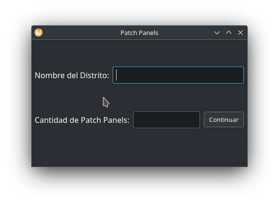
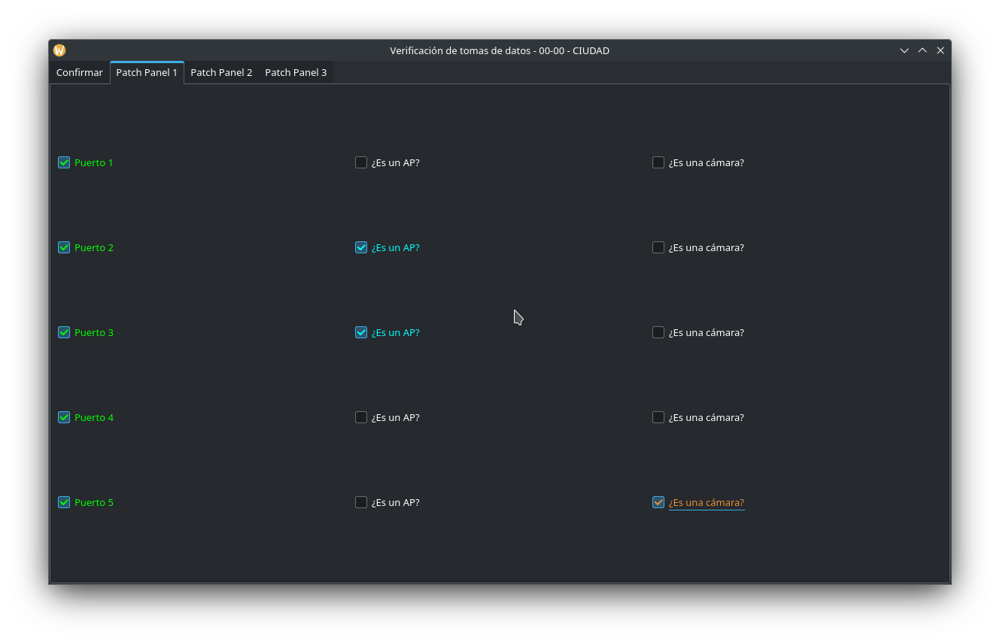
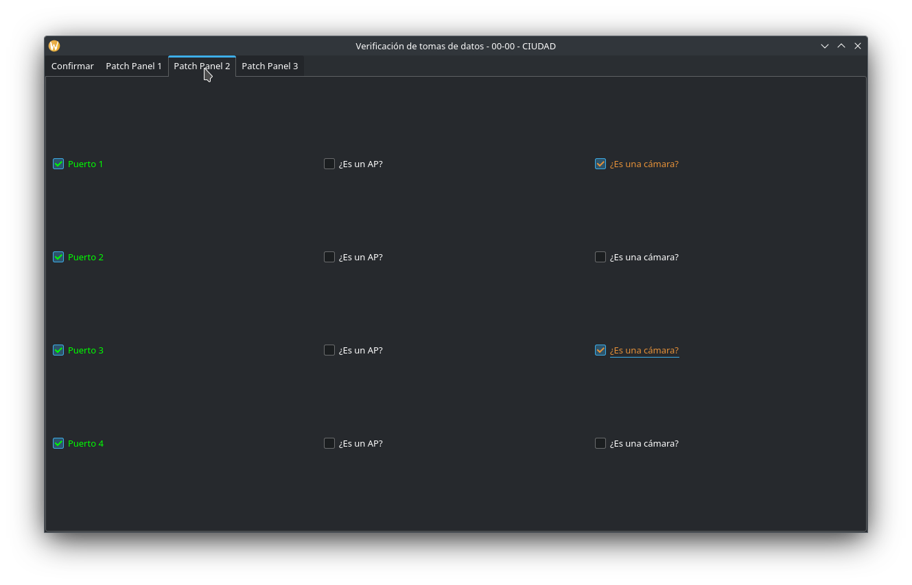
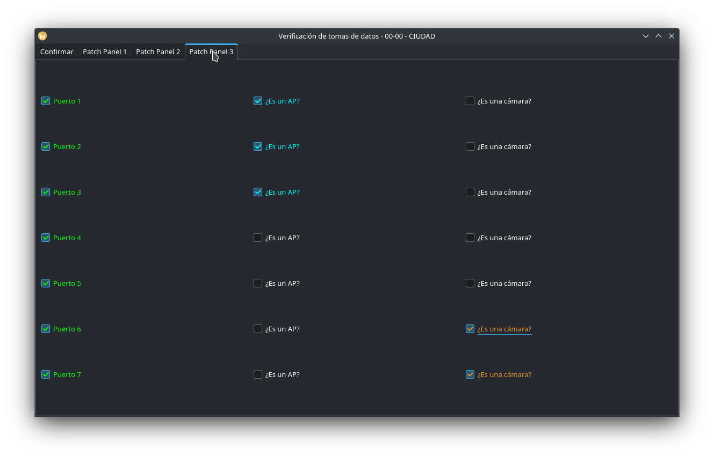
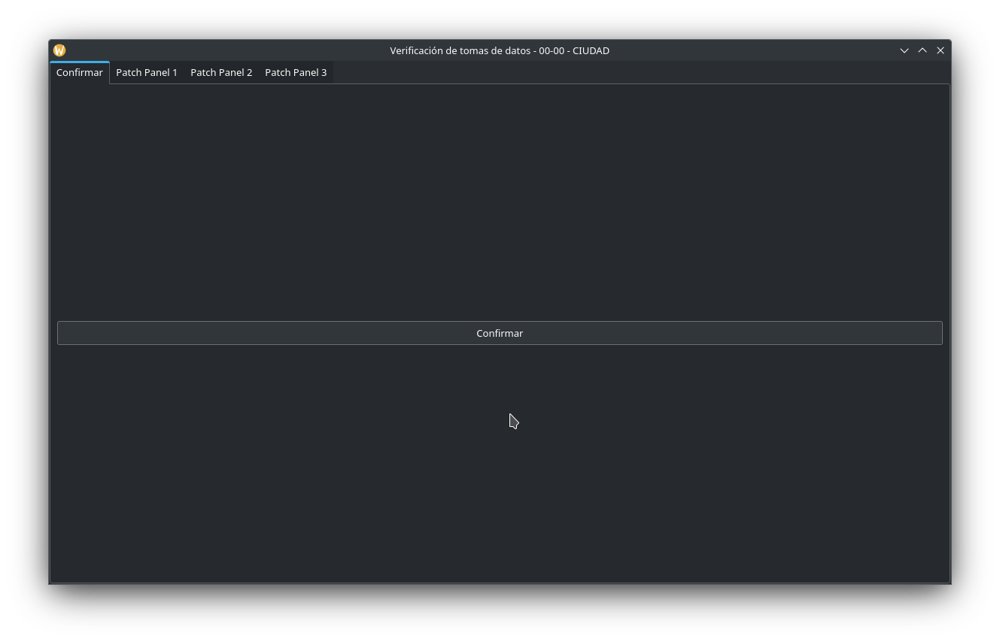
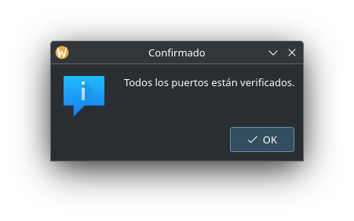
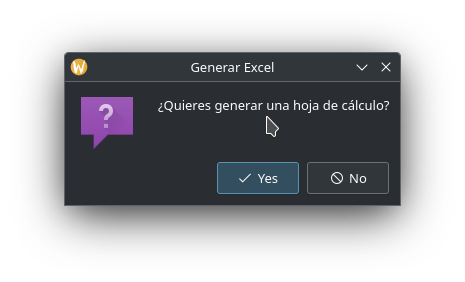
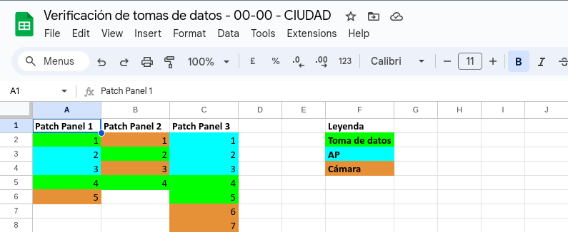

# CheckPatchPanelsAndPorts
Este programa me permite verificar las evidencias de Patch Panel y puertos de los mismos de los Distritos Educativos que Telenord está poniéndole internet. Así mismo, me exporta la información que maneja en un Excel.

# Capturas de Pantalla

